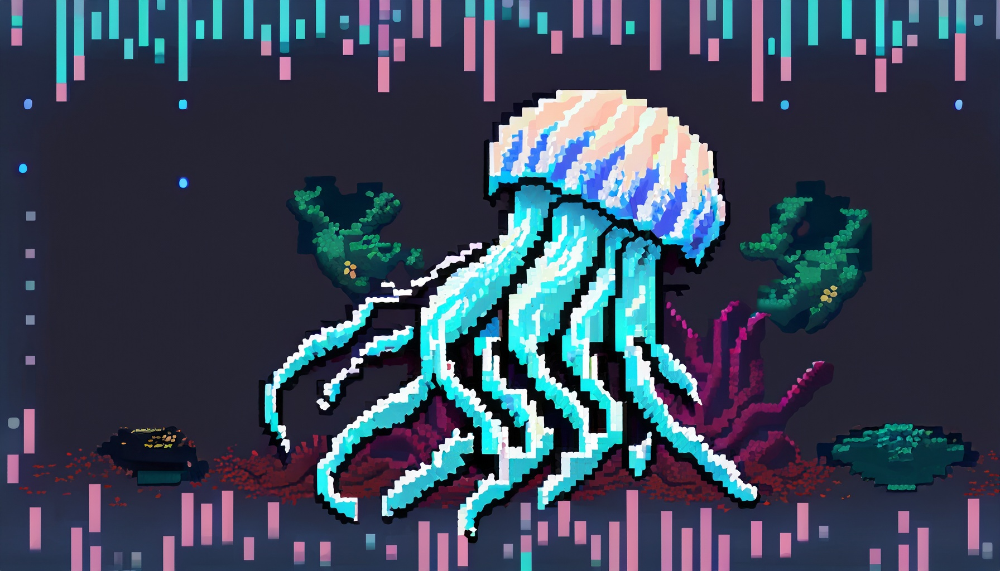

<p align="center">
    
</p>

<h1 align="center">Jellyphish</h1>
<h3 align="center">A modification of <a href="https://getgophish.com">Gophish</a></h3>

---

## 🚀 Basic Roadmap

|   Status    | Feature                                         | Description                                                            |
|:-----------:|-------------------------------------------------|------------------------------------------------------------------------|
|     ✔️      | XSLX reports                                    | Reporting feature                                                      |
|     ✔️      | Activity detected statistic                     | Detect user activity - useful for determining if sandboxes are in use  |
|     ✔️      | Fixed statistics in dashboard and campaign      | The statistics now are TRUE statistics not imagined like it was before |
|     ✔️      | Adjustments to hinder the boys in blue          | Changes in headers, new error logs, added parameters, etc.             |
|  Planning   | Evil ngnix                                      | Long-term goals                                                        |
|  Planning   | Edit the tracker                                | We'll see what we can do                                               |
| In progress | Smishing                                        | Long-term goals                                                        |

## 🧐 More Interesting Stuff

### Activity Detected Statistic
This new feature 'recognizes' valid users (well it tries):

<p align="center">
    
    <br>
    <em>Information on the activity detection</em>
</p>

A new statistic titled "Activity Detected" has been introduced for cases when many sandboxes don't even access the page through a browser - perfect for phishing campaigns that has a lot of undefined security mechanisms.

<p align="center">
    
    <br>
    <em>Note: Statistics now only show the unique events saved in the GOPHISH database</em>
</p>

---

🚨 **Disclaimer**: I am not a programmer. If you have any tips or ideas, please reach out to me!

---

## 📚 How To
For detailed instructions, please refer to the [Gophish documentation](https://getgophish.com).

## 🔖 License
### License - for Jellyphish - the same
```
Gophish - Open-Source Phishing Framework

The MIT License (MIT)

Copyright (c) 2013 - 2020 Jordan Wright

Permission is hereby granted, free of charge, to any person obtaining a copy
of this software ("Gophish Community Edition") and associated documentation files (the "Software"), to deal
in the Software without restriction, including without limitation the rights
to use, copy, modify, merge, publish, distribute, sublicense, and/or sell
copies of the Software, and to permit persons to whom the Software is
furnished to do so, subject to the following conditions:

The above copyright notice and this permission notice shall be included in
all copies or substantial portions of the Software.

THE SOFTWARE IS PROVIDED "AS IS", WITHOUT WARRANTY OF ANY KIND, EXPRESS OR
IMPLIED, INCLUDING BUT NOT LIMITED TO THE WARRANTIES OF MERCHANTABILITY,
FITNESS FOR A PARTICULAR PURPOSE AND NONINFRINGEMENT. IN NO EVENT SHALL THE
AUTHORS OR COPYRIGHT HOLDERS BE LIABLE FOR ANY CLAIM, DAMAGES OR OTHER
LIABILITY, WHETHER IN AN ACTION OF CONTRACT, TORT OR OTHERWISE, ARISING FROM,
OUT OF OR IN CONNECTION WITH THE SOFTWARE OR THE USE OR OTHER DEALINGS IN
THE SOFTWARE.
```
